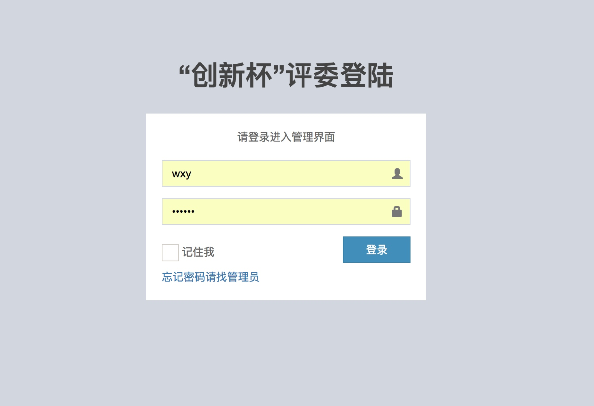
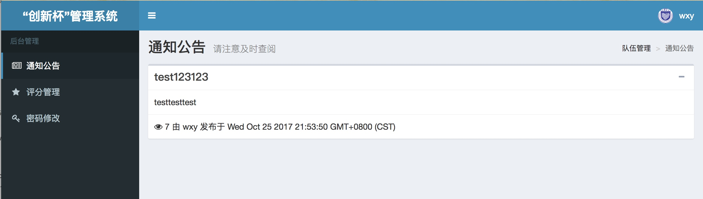
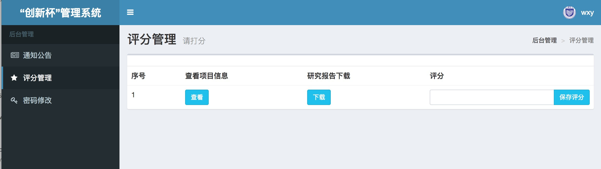
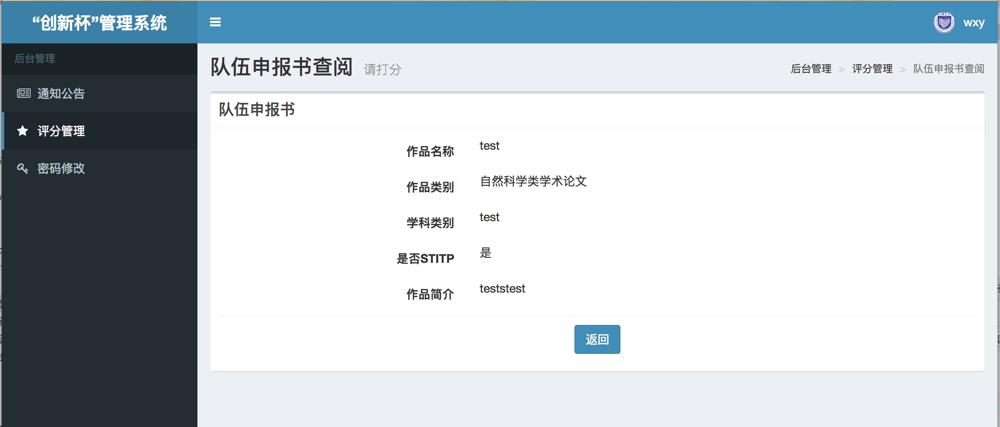
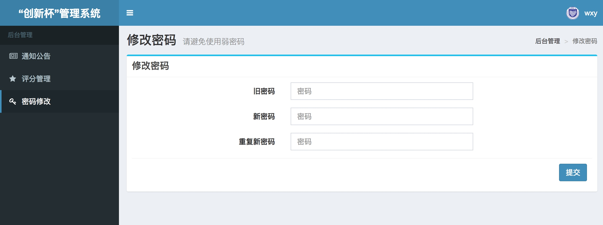

# 评委部分使用说明
1. 登陆界面
输入用户名密码即可登陆。
系统不会储存明文密码，如果忘记密码请直接联系管理员进行重置。

2. 通知公告
请及时查看站内通知公告

 
3. 评分管理
点击查看可查看对应队伍的项目信息
点击下载会下载对应队伍的研究报告
输入评分后请点击保存评分按钮进行保存

4. 修改密码
请及时修改默认密码，请勿使用弱密码。

如果在使用过程中遇到问题可直接联系管理员。谢谢您的配合。

