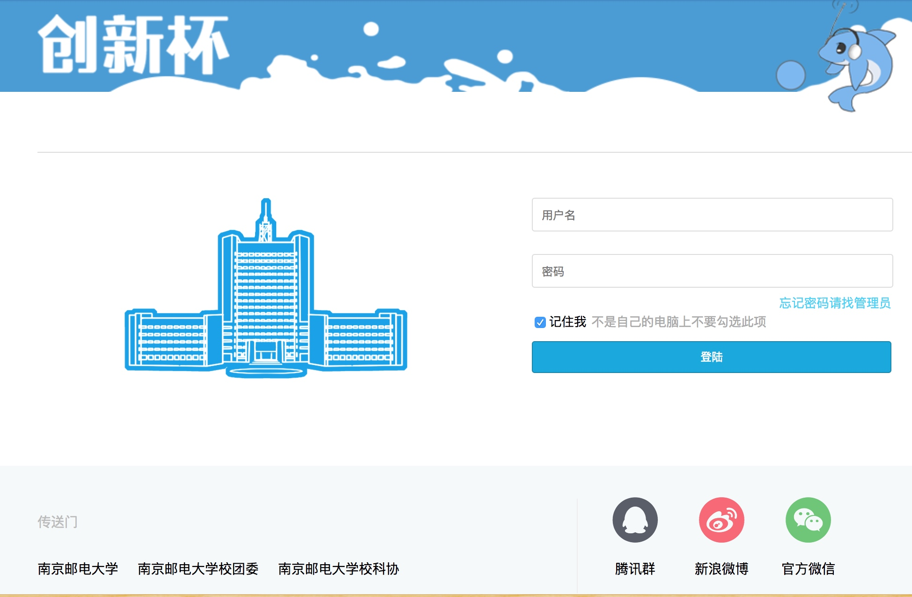
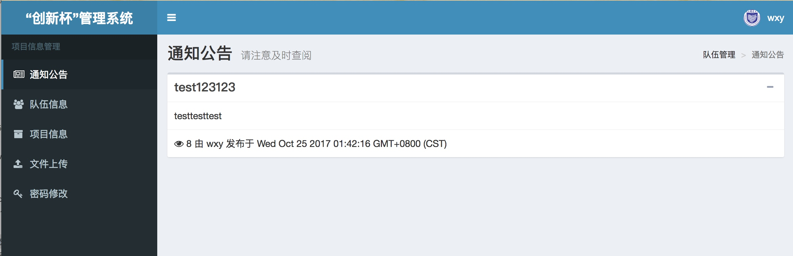
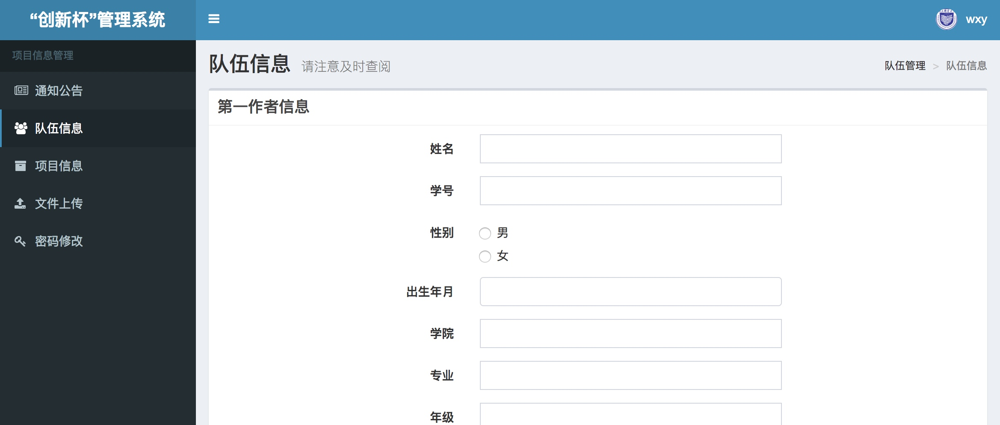
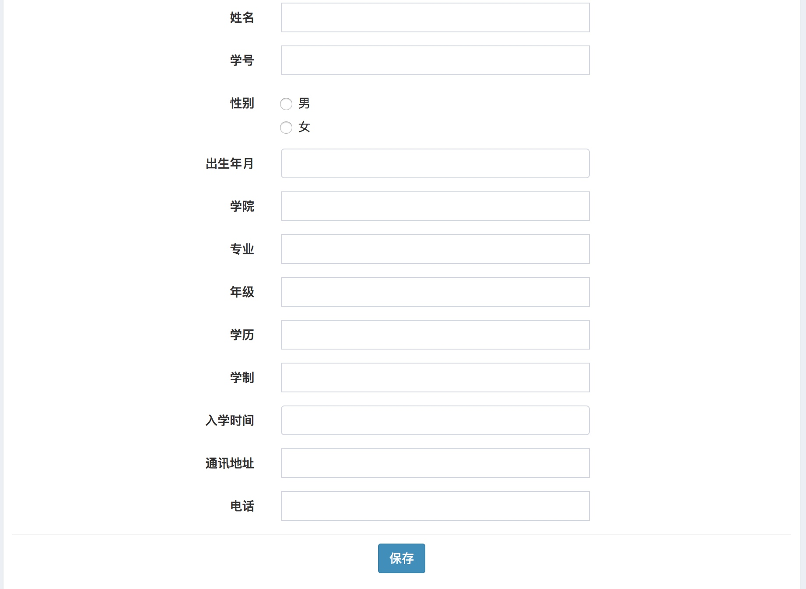
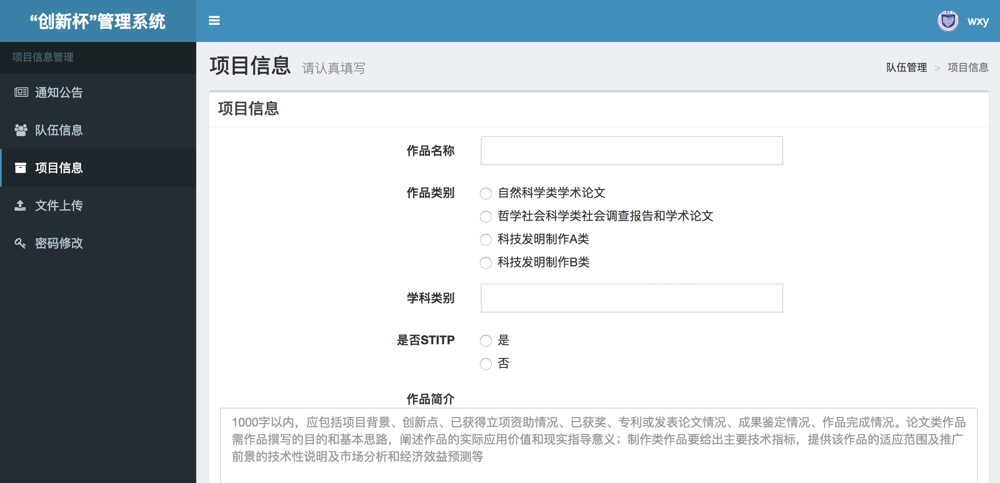
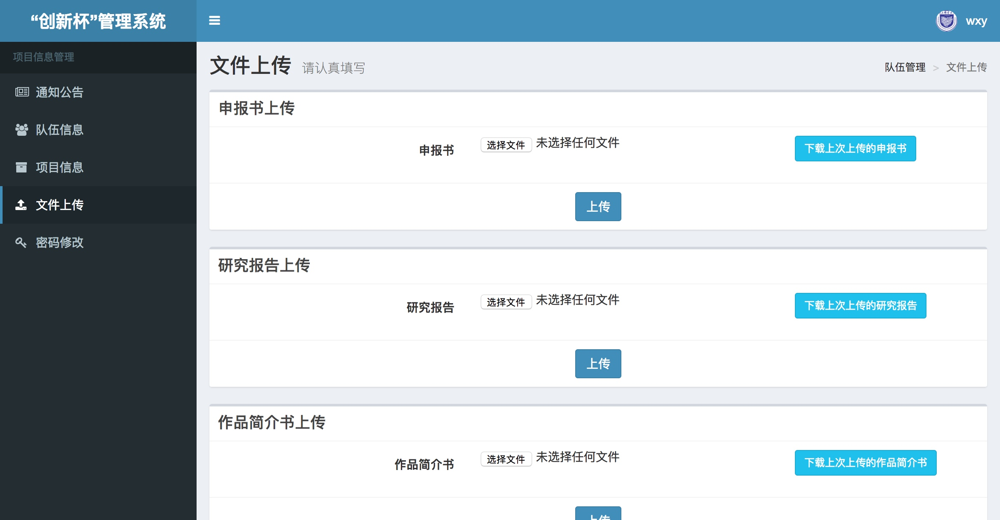
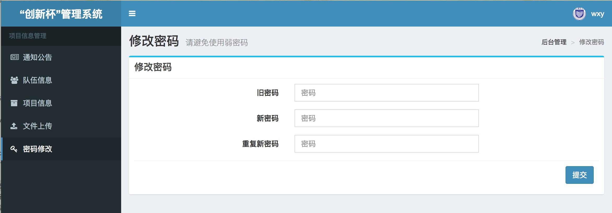

# 选手部分使用说明

1. 登陆界面：
输入用户名密码即可登陆。
系统不会储存明文密码，如果忘记密码请在相关 qq 群中找管理员进行重置。

2. 通知公告页面
请及时查看站内通知公告

3. 队伍信息
每一部分都有单独的保存按钮，填写完成后请记得点击。

4. 项目信息
项目信息同上

5. 文件上传
三份文件分别上传。如果多次上传，系统会以最后一次上传的文件为准。

6. 修改密码
请及时修改默认密码，请勿使用弱密码。

如果使用过程中有疑问，请在相关 qq 群中咨询。
如果发现 bug，请点击右下角的链接前往 Github 发 issue 或直接联系管理员。

